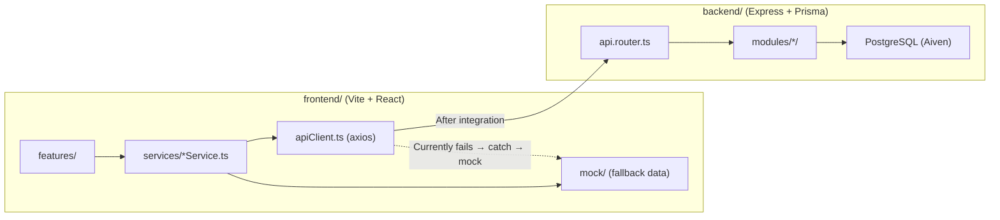

# 🔗 Frontend ↔ Backend Integration Plan — Zero Merge Conflicts

**Team**: Dev A, Dev B, Dev C  
**Current state**: Frontend runs on mock data (`src/mock/` + `try/catch` fallbacks in services). Backend has all 17 modules wired into `api.router.ts`.  
**Goal**: Rip out mock fallbacks, connect to the real backend, and fix any contract mismatches.

---

## 🏗️ Architecture Overview (Current State)



### Key Integration Pattern in Every Service File
Every frontend service currently does:
```ts
try {
  const res = await apiClient.get('/endpoint');   // ← real API call
  return res.data;
} catch {
  return mockData;  // ← fallback to mock
}
```
**Integration work** = make the `try` path work correctly, then delete the `catch` mock fallback.

---

## 🚨 Pre-Integration Setup (ALL DEVS — 30 min)

Before anyone touches domain code, these shared files must be correct:

### 1. Vite Proxy (Dev C owns this file)
Add a proxy to [`vite.config.ts`](file:///c:/Users/vihaa/Desktop/College/Diploma/Sport-Club-Management-System/frontend/vite.config.ts) so `apiClient` hits the backend:
```ts
server: {
  port: 5173,
  proxy: {
    '/api': {
      target: 'http://localhost:3000',
      changeOrigin: true,
    },
    '/uploads': {
      target: 'http://localhost:3000',
      changeOrigin: true,
    },
  },
}
```

### 2. API Client Fix (Dev C owns this file)
Update [`apiClient.ts`](file:///c:/Users/vihaa/Desktop/College/Diploma/Sport-Club-Management-System/frontend/src/services/apiClient.ts):
- Change `BASE_URL` to `/api/v1` (currently `/api`)
- Fix refresh token flow: backend uses **httpOnly cookies**, not `localStorage.getItem('refresh_token')`
- Add `withCredentials: true` to the axios instance for cookie handling

### 3. Auth Store Alignment (Dev C owns this file)
Update [`authStore.ts`](file:///c:/Users/vihaa/Desktop/College/Diploma/Sport-Club-Management-System/frontend/src/stores/authStore.ts):
- Backend returns `{ success, data: { accessToken, user } }` — unwrap correctly
- Remove `refresh_token` from localStorage (it's a httpOnly cookie now)

### 4. Backend CORS (Dev A owns this file)
Ensure [`app.ts`](file:///c:/Users/vihaa/Desktop/College/Diploma/Sport-Club-Management-System/backend/src/app.ts) has:
```ts
cors({ origin: 'http://localhost:5173', credentials: true })
```

> [!IMPORTANT]  
> These 4 setup tasks MUST be done first and merged before parallel work begins. They touch shared infrastructure files that everyone depends on.

---

## 👥 Developer Assignments — Zero Conflict File Ownership

The key to zero merge conflicts: **each developer owns exclusive files**. Nobody touches another dev's files.

### File Ownership Map

| Directory / File | Dev A | Dev B | Dev C |
|---|:---:|:---:|:---:|
| `frontend/src/services/authService.ts` | ✅ | | |
| `frontend/src/services/courtService.ts` | ✅ | | |
| `frontend/src/services/bookingService.ts` | ✅ | | |
| `frontend/src/services/publicService.ts` | ✅ | | |
| `frontend/src/services/leadService.ts` | ✅ | | |
| `frontend/src/services/reportService.ts` | ✅ | | |
| `frontend/src/services/invoiceService.ts` | ✅ | | |
| `frontend/src/services/paymentService.ts` | ✅ | | |
| `frontend/src/features/auth/**` | ✅ | | |
| `frontend/src/features/bookings/**` | ✅ | | |
| `frontend/src/features/facilities/**` | ✅ | | |
| `frontend/src/features/public/**` | ✅ | | |
| `frontend/src/features/leads/**` | ✅ | | |
| `frontend/src/features/reports/**` | ✅ | | |
| `frontend/src/features/invoices/**` | ✅ | | |
| `frontend/src/features/payments/**` | ✅ | | |
| `frontend/src/services/memberService.ts` | | ✅ | |
| `frontend/src/services/equipmentService.ts` | | ✅ | |
| `frontend/src/services/orderService.ts` | | ✅ | |
| `frontend/src/services/menuService.ts` | | ✅ | |
| `frontend/src/services/barService.ts` | | ✅ | |
| `frontend/src/services/staffService.ts` | | ✅ | |
| `frontend/src/features/members/**` | | ✅ | |
| `frontend/src/features/equipment/**` | | ✅ | |
| `frontend/src/features/orders/**` | | ✅ | |
| `frontend/src/features/menu/**` | | ✅ | |
| `frontend/src/features/bar/**` | | ✅ | |
| `frontend/src/features/staff/**` | | ✅ | |
| `frontend/src/features/memberships/**` | | ✅ | |
| `frontend/src/features/commerce/**` | | ✅ | |
| `frontend/vite.config.ts` | | | ✅ |
| `frontend/src/services/apiClient.ts` | | | ✅ |
| `frontend/src/stores/**` | | | ✅ |
| `frontend/src/types/**` | | | ✅ |
| `frontend/src/components/**` | | | ✅ |
| `frontend/src/features/dashboard/**` | | | ✅ |
| `frontend/src/features/settings/**` | | | ✅ |
| `frontend/src/features/crm/**` | | | ✅ |
| `frontend/src/features/adminPublic/**` | | | ✅ |
| `frontend/src/App.tsx` | | | ✅ |
| `frontend/src/mock/**` | | | ✅ (final cleanup) |
| `backend/**` | 🔒 | 🔒 | |

> [!NOTE]
> Backend is **already built**. Dev A & B do NOT touch backend code during integration (unless a bug is found). Their job is purely on the **frontend service/feature files** they own.

---

## 📋 Dev A — Auth, Bookings, Public Portal, Reports (8 services, ~8 features)

Dev A handles the modules they originally built on the backend, so they understand the exact response shapes.

### Phase 1: Auth Integration (Priority — everything else depends on this)

#### File: [`authService.ts`](file:///c:/Users/vihaa/Desktop/College/Diploma/Sport-Club-Management-System/frontend/src/services/authService.ts)

**Current problems:**
- Mock fallback creates fake `User` objects with string IDs like `'USR-ADMIN'` — backend uses integer IDs
- `signup` calls `/auth/signup` — backend has `POST /api/v1/public/register` (PU-07) instead
- `requestPasswordReset`, `verifyOtp`, `resetPassword` — these endpoints don't exist in the backend API contract. Keep them as client-side mock for now
- Refresh uses `localStorage` — backend uses httpOnly cookie

**Tasks:**
1. Fix `login()` — unwrap `response.data.data.accessToken` and `response.data.data.user`
2. Fix `signup()` → point to `/public/register` and match PU-07's request body shape
3. Fix `logout()` → add `withCredentials: true`
4. Fix `getCurrentUser()` → unwrap `response.data.data`
5. Remove all mock fallback `catch` blocks — replace with proper error throwing
6. Delete all `OTP_STORAGE_KEY`, `REGISTERED_USERS_KEY` localStorage mock logic

**Contract mismatch to fix:**
```diff
// Frontend User type expects:
-  id: string       (e.g., 'USR-ADMIN')
+  id: number       (e.g., 42)

// Login response shape:
-  { user, token }
+  { success: true, data: { accessToken, expiresIn, user: { id, email, firstName, lastName, role, tier, status } } }
```

#### File: `features/auth/LoginPage.tsx`, `SignupPage.tsx`, `ForgotPasswordPage.tsx`
- Update `LoginPage` to use the corrected `authService.login()` return shape
- Update `SignupPage` to POST to `/public/register` with `{ firstName, lastName, email, password, phone, dateOfBirth, tier, planId, address }`
- `ForgotPasswordPage` — keep as mock-only (no backend endpoint exists)

---

### Phase 2: Courts & Bookings

#### File: [`courtService.ts`](file:///c:/Users/vihaa/Desktop/College/Diploma/Sport-Club-Management-System/frontend/src/services/courtService.ts)

**Tasks:**
1. `getAll()` → `GET /courts` — unwrap `response.data.data`
2. `getAvailability()` → `GET /courts/availability?date=YYYY-MM-DD&courtId=X`
3. Remove mock fallbacks

#### File: [`bookingService.ts`](file:///c:/Users/vihaa/Desktop/College/Diploma/Sport-Club-Management-System/frontend/src/services/bookingService.ts)

**Tasks:**
1. `getAll()` → `GET /bookings` — fix pagination unwrap (`data.data` + `data.pagination`)
2. `create()` → `POST /bookings` — match BK-02 body: `{ courtId, date, slotStart, slotEnd, bookingType }`
3. `getById()` → `GET /bookings/:id`
4. `cancel()` → `PUT /bookings/:id/cancel`
5. `createSocial()` → `POST /bookings/social` — match BK-05 body
6. `getToday()` → `GET /bookings/today`
7. Remove all mock fallbacks

**Key contract issues:**
- Frontend booking IDs are strings (`'BK-1001'`), backend uses integers
- Frontend uses `facilityName`, backend uses `courtName`
- Frontend `totalPrice` is in rupees, backend `amount_paise` is in paise

#### Files: `features/bookings/*.tsx`, `features/facilities/*.tsx`
- Update all components to use integer IDs
- Fix price display: divide `amountPaise` by 100 for display (`₹{(amountPaise / 100).toFixed(2)}`)

---

### Phase 3: Public Portal & Leads

#### File: [`publicService.ts`](file:///c:/Users/vihaa/Desktop/College/Diploma/Sport-Club-Management-System/frontend/src/services/publicService.ts)

**Tasks:**
1. `getPlans()` → `GET /public/plans`
2. `getCourts()` → `GET /public/courts`
3. `getEquipment()` → `GET /public/equipment`
4. `getSlots()` → `GET /public/slots?date=YYYY-MM-DD`
5. `submitEnquiry()` → `POST /public/leads`
6. `requestTrial()` → `POST /public/trial`
7. `register()` → `POST /public/register`
8. Remove mock fallbacks

#### File: [`leadService.ts`](file:///c:/Users/vihaa/Desktop/College/Diploma/Sport-Club-Management-System/frontend/src/services/leadService.ts)

**Tasks:**
1. `getAll()` → `GET /leads` with pagination
2. `getById()` → `GET /leads/:id`
3. `update()` → `PUT /leads/:id` (status change)
4. Remove mock fallbacks

---

### Phase 4: Reports, Invoices, Payments

#### File: [`reportService.ts`](file:///c:/Users/vihaa/Desktop/College/Diploma/Sport-Club-Management-System/frontend/src/services/reportService.ts)

**Tasks:**
1. Wire up all 6 report endpoints: `GET /reports/revenue`, `/reports/courts`, `/reports/members`, `/reports/inventory`, `/reports/bar`, `/reports/staff`
2. Each returns a different shape — map to the frontend `ReportData` types
3. Remove mock fallbacks

#### File: [`invoiceService.ts`](file:///c:/Users/vihaa/Desktop/College/Diploma/Sport-Club-Management-System/frontend/src/services/invoiceService.ts)

**Tasks:**
1. `getDueMembers()` → `GET /invoices/members`
2. `generate()` → `POST /invoices/:memberId`
3. Remove mock fallbacks

#### File: [`paymentService.ts`](file:///c:/Users/vihaa/Desktop/College/Diploma/Sport-Club-Management-System/frontend/src/services/paymentService.ts)

**Tasks:**
1. `getAll()` → `GET /payments` with pagination
2. Remove mock fallbacks

---

## 📋 Dev B — Members, Equipment, Orders, Bar, Staff, Menu (6 services, ~8 features)

Dev B handles the modules they originally built on the backend.

### Phase 1: Members & Memberships

#### File: [`memberService.ts`](file:///c:/Users/vihaa/Desktop/College/Diploma/Sport-Club-Management-System/frontend/src/services/memberService.ts)

**This is the biggest file (458 lines)** — most of it is mock data. After integration it should be ~80 lines.

**Tasks:**
1. Delete the entire `localMembers` array, `defaultAddresses`, `defaultLedgers` (lines 21–178)
2. Delete all mock imports (`mockMembers`, `mockBookings`, `mockOrders`, `mockBarTabs`)
3. Fix every method:
   - `getAll()` → unwrap `response.data.data` (paginated) + `response.data.pagination`
   - `create()` → match ME-02 body shape (camelCase `firstName`, `lastName`, `planId`, etc.)
   - `getById()` → unwrap `response.data.data`
   - `update()` → match ME-04 body, unwrap response
   - `renew()` → `POST /members/:id/renew` with `{ durationMonths, paymentMethod, amountPaise, referenceNo }`
   - `getHistory()` → `GET /members/:id/history`
   - `getAddress()` → `GET /members/:id/address`
   - `updateAddress()` → `PUT /members/:id/address`
   - `deleteAddress()` → `DELETE /members/:id/address`
4. Delete `getLedger()` — not in the API contract (history covers it)

**Key contract issues:**
- Frontend `MemberDetail.id` is `string` (`'MEM-001'`), backend is `number` (`1`)
- Frontend `name` is a single field, backend returns `firstName` + `lastName` separately
- Frontend `membershipPlan` field → backend uses `tier`
- Frontend `joinedDate` → backend `membershipStart`

#### Files: `features/members/MembersPage.tsx`, `MemberDetailPage.tsx`, `components/*`
- Fix all ID references from strings to numbers
- Fix member name display: use `${member.firstName} ${member.lastName}` or backend's computed field
- Fix membership tier badge mapping

#### File: `features/memberships/MembershipsPage.tsx`
- Wire to `GET /membership-plans` for admin plan management
- `POST /membership-plans`, `PUT /membership-plans/:id`

---

### Phase 2: Equipment & Orders (Shop)

#### File: [`equipmentService.ts`](file:///c:/Users/vihaa/Desktop/College/Diploma/Sport-Club-Management-System/frontend/src/services/equipmentService.ts)

**Tasks:**
1. `getAll()` → `GET /equipment` — paginated, unwrap `data.data`
2. `create()` → `POST /equipment`
3. `getById()` → `GET /equipment/:id`
4. `update()` → `PUT /equipment/:id`
5. Remove mock fallbacks

#### File: [`orderService.ts`](file:///c:/Users/vihaa/Desktop/College/Diploma/Sport-Club-Management-System/frontend/src/services/orderService.ts)

**Tasks:**
1. `getAll()` → `GET /orders` — paginated
2. `create()` → `POST /orders` — match OR-02 body
3. `getById()` → `GET /orders/:id`
4. `updateStatus()` → `PUT /orders/:id/status`
5. Remove mock fallbacks

**Key contract issue:**
- Frontend `totalPrice` in rupees → backend `totalPaise` / `amountPaise` in paise

---

### Phase 3: Menu & Bar POS

#### File: [`menuService.ts`](file:///c:/Users/vihaa/Desktop/College/Diploma/Sport-Club-Management-System/frontend/src/services/menuService.ts)

**Tasks:**
1. `getAll()` → `GET /menu-items`
2. `create()` → `POST /menu-items`
3. `getById()` → `GET /menu-items/:id`
4. `update()` → `PUT /menu-items/:id`
5. Remove mock fallbacks

#### File: [`barService.ts`](file:///c:/Users/vihaa/Desktop/College/Diploma/Sport-Club-Management-System/frontend/src/services/barService.ts)

**Tasks:**
1. `getTables()` → `GET /bar/tables`
2. `createTable()` → `POST /bar/tables`
3. `updateTable()` → `PUT /bar/tables/:id`
4. `getTabs()` → `GET /bar/tabs`
5. `getTab()` → `GET /bar/tabs/:id`
6. `openTab()` → `POST /bar/tabs`
7. `addItems()` → `POST /bar/tabs/:id/items`
8. `settleTab()` → `PUT /bar/tabs/:id/settle`
9. Remove mock fallbacks

#### Files: `features/bar/*.tsx`
- Fix tab total display (paise → rupees)
- Fix table/tab ID types

---

### Phase 4: Staff & HR

#### File: [`staffService.ts`](file:///c:/Users/vihaa/Desktop/College/Diploma/Sport-Club-Management-System/frontend/src/services/staffService.ts)

**Tasks:**
1. `getAll()` → `GET /staff`
2. `create()` → `POST /staff`
3. `getById()` → `GET /staff/:id`
4. `update()` → `PUT /staff/:id`
5. `startShift()` → `POST /staff/:id/shifts`
6. `endShift()` → `PUT /staff/:id/shifts/:shiftId`
7. `submitLeave()` → `POST /leave`
8. `getLeave()` → `GET /staff/:id/leave`
9. `approveLeave()` → `PUT /leave/:id`
10. Remove mock fallbacks

---

## 📋 Dev C — Shared Infrastructure, Types, Stores, Dashboard, Shared Components

Dev C handles the "glue" — the shared infrastructure that Dev A and Dev B depend on, plus the dashboard and settings that aggregate data from multiple services.

### Phase 1: Infrastructure (DO THIS FIRST — Day 1)

#### File: [`vite.config.ts`](file:///c:/Users/vihaa/Desktop/College/Diploma/Sport-Club-Management-System/frontend/vite.config.ts)
- Add proxy config (see Pre-Integration Setup above)

#### File: [`apiClient.ts`](file:///c:/Users/vihaa/Desktop/College/Diploma/Sport-Club-Management-System/frontend/src/services/apiClient.ts)
- Fix `BASE_URL` → `/api/v1`
- Add `withCredentials: true`
- Fix refresh flow to use cookie-based refresh (no body, just `POST /auth/refresh` with credentials)
- Fix the response interceptor to handle the `{ success, data, error }` envelope pattern

#### File: [`authStore.ts`](file:///c:/Users/vihaa/Desktop/College/Diploma/Sport-Club-Management-System/frontend/src/stores/authStore.ts)
- Remove `refresh_token` from localStorage handling
- Fix `login()` to accept the unwrapped API response shape

---

### Phase 2: Type Alignment (Critical for Dev A & B)

#### Files: All `frontend/src/types/*.ts`

> [!WARNING]
> Dev C MUST finish type fixes BEFORE Dev A and Dev B start their service file edits. Otherwise they'll be coding against wrong types.

**Key type changes needed across files:**

| File | Change |
|------|--------|
| [`auth.ts`](file:///c:/Users/vihaa/Desktop/College/Diploma/Sport-Club-Management-System/frontend/src/types/auth.ts) | `User.id`: `string` → `number`. Add `firstName`, `lastName`. Fix `role` enum values |
| [`members.ts`](file:///c:/Users/vihaa/Desktop/College/Diploma/Sport-Club-Management-System/frontend/src/types/members.ts) | `MemberDetail.id`: `string` → `number`. Replace `name` with `firstName`+`lastName`. `membershipPlan` → `tier`. `joinedDate` → `membershipStart` |
| [`bookings.ts`](file:///c:/Users/vihaa/Desktop/College/Diploma/Sport-Club-Management-System/frontend/src/types/bookings.ts) | IDs: `string` → `number`. `facilityName` → `courtName`. Prices in paise |
| [`courts.ts`](file:///c:/Users/vihaa/Desktop/College/Diploma/Sport-Club-Management-System/frontend/src/types/courts.ts) | IDs: `string` → `number` |
| [`equipment.ts`](file:///c:/Users/vihaa/Desktop/College/Diploma/Sport-Club-Management-System/frontend/src/types/equipment.ts) | IDs: `string` → `number`. Prices in paise |
| [`orders.ts`](file:///c:/Users/vihaa/Desktop/College/Diploma/Sport-Club-Management-System/frontend/src/types/orders.ts) | IDs: `string` → `number`. Prices in paise |
| [`menu.ts`](file:///c:/Users/vihaa/Desktop/College/Diploma/Sport-Club-Management-System/frontend/src/types/menu.ts) | IDs: `string` → `number`. Prices in paise |
| [`bar.ts`](file:///c:/Users/vihaa/Desktop/College/Diploma/Sport-Club-Management-System/frontend/src/types/bar.ts) | IDs: `string` → `number`. Prices in paise |
| [`staff.ts`](file:///c:/Users/vihaa/Desktop/College/Diploma/Sport-Club-Management-System/frontend/src/types/staff.ts) | IDs: `string` → `number` |
| [`leads.ts`](file:///c:/Users/vihaa/Desktop/College/Diploma/Sport-Club-Management-System/frontend/src/types/leads.ts) | IDs: `string` → `number` |
| [`payments.ts`](file:///c:/Users/vihaa/Desktop/College/Diploma/Sport-Club-Management-System/frontend/src/types/payments.ts) | IDs: `string` → `number`. Amounts in paise |
| [`invoices.ts`](file:///c:/Users/vihaa/Desktop/College/Diploma/Sport-Club-Management-System/frontend/src/types/invoices.ts) | IDs: `string` → `number` |
| [`reports.ts`](file:///c:/Users/vihaa/Desktop/College/Diploma/Sport-Club-Management-System/frontend/src/types/reports.ts) | Amounts in paise |
| [`api.ts`](file:///c:/Users/vihaa/Desktop/College/Diploma/Sport-Club-Management-System/frontend/src/types/api.ts) | Add `ApiResponse<T> = { success: boolean; data: T; error?: { code: string; message: string } }` |
| [`public.ts`](file:///c:/Users/vihaa/Desktop/College/Diploma/Sport-Club-Management-System/frontend/src/types/public.ts) | IDs: `string` → `number`. Match PU-07 register shape |

**Add a shared helper** in [`utils.ts`](file:///c:/Users/vihaa/Desktop/College/Diploma/Sport-Club-Management-System/frontend/src/lib/utils.ts):
```ts
/** Convert paise to rupee display string */
export const formatPaise = (paise: number): string => `₹${(paise / 100).toFixed(2)}`;

/** Unwrap the standard { success, data } API envelope */
export const unwrap = <T>(response: { data: { success: boolean; data: T } }): T => response.data.data;
```

---

### Phase 3: Shared UI Components

#### Files: `frontend/src/components/ui/*.tsx`
- Add a generic `ApiErrorAlert` component for displaying backend error responses
- Add a `PriceDisplay` component that auto-converts paise → rupees
- Update `Skeleton` / `GlobalLoader` to work with React Query loading states

#### Files: `frontend/src/components/layout/*`
- Update `AppShell` to fetch user from `GET /auth/me` on mount (instead of trusting localStorage)
- Add a `ProtectedRoute` wrapper that redirects to `/login` if not authenticated

---

### Phase 4: Dashboard & Settings

#### File: `features/dashboard/DashboardPage.tsx`
- This page aggregates data from multiple services (members count, bookings today, revenue, etc.)
- Wire to the real report endpoints after Dev A finishes report service integration
- Use React Query's `useQueries` for parallel fetching

#### File: `features/settings/SettingsPage.tsx`
- Wire profile update to `PUT /members/:id` (for member self-edit) or `PUT /staff/:id` (for staff)

#### File: `features/crm/**` and `features/adminPublic/**`
- These are UI shells — wire them to the services once Dev A/B finish

---

### Phase 5: Mock Cleanup (LAST — after everything works)

#### File: `frontend/src/mock/**`
- Delete all 17 mock data files
- Delete `frontend/src/mock/index.ts`
- Remove all `import from '@/mock/*'` across the codebase (Dev A & B should have already removed them from their owned files)

---

## ⏱️ Execution Timeline

```mermaid
gantt
    title Integration Sprint (3 Developers)
    dateFormat HH:mm
    axisFormat %H:%M

    section Dev C (Infrastructure)
    Vite proxy + apiClient fix          :c1, 00:00, 1h
    Type alignment (all types/*.ts)     :c2, after c1, 2h
    Auth store + ProtectedRoute         :c3, after c1, 1h
    Shared UI (ApiError, PriceDisplay)  :c4, after c2, 1h
    Dashboard wiring                    :c5, after c4, 2h
    Mock cleanup                        :c6, after c5, 1h

    section Dev A (Auth + Bookings + Public)
    authService.ts + LoginPage          :a1, after c2, 2h
    courtService + bookingService       :a2, after a1, 2h
    publicService + leadService         :a3, after a2, 2h
    reportService + invoiceService      :a4, after a3, 1h
    paymentService                      :a5, after a4, 30min

    section Dev B (Members + Shop + Bar + Staff)
    memberService.ts (big rewrite)      :b1, after c2, 2h
    Members pages + Memberships         :b2, after b1, 1h
    equipmentService + orderService     :b3, after b2, 2h
    menuService + barService            :b4, after b3, 2h
    staffService + HR pages             :b5, after b4, 1h
```



> [!TIP]
> **Dev C finishes types first (Phase 2) and pushes**. Dev A & B pull that commit before starting their work. This is the critical dependency.

---

## 🔒 Git Branch Strategy (No Conflicts)

```
main
 └── integration/setup       ← Dev C: vite proxy, apiClient, types, authStore
      ├── integration/dev-a   ← Dev A: auth, bookings, public, reports services + features
      ├── integration/dev-b   ← Dev B: members, equipment, orders, bar, staff services + features
      └── integration/dev-c   ← Dev C: dashboard, settings, shared components, mock cleanup
```

**Merge order:**
1. `integration/setup` → `main` (Dev C's infrastructure)
2. `integration/dev-a` → `main` (rebased on setup)
3. `integration/dev-b` → `main` (rebased on setup)
4. `integration/dev-c` → `main` (rebased on dev-a + dev-b, includes mock cleanup)

> [!CAUTION]
> **Never** have two devs edit the same file. The ownership table above is the law. If you need a change in someone else's file, tell them on Slack and they'll do it.

---

## 🧪 Testing Checklist

Each dev tests their own modules end-to-end before merging:

### Dev A
- [ ] Login with valid member credentials → redirects to dashboard
- [ ] Login with valid staff credentials → shows admin sidebar
- [ ] Invalid credentials → shows error toast
- [ ] Token refresh works (wait 15 min or manually expire)
- [ ] Court list loads from DB
- [ ] Slot availability shows correct data for a given date
- [ ] Create booking → appears in list
- [ ] Cancel booking → status updates
- [ ] Public portal loads plans, courts, slots without auth
- [ ] Submit enquiry from public portal → appears in leads list
- [ ] Reports pages render charts with real data
- [ ] Invoice generation works

### Dev B
- [ ] Member list loads with pagination
- [ ] Search, tier filter, status filter work
- [ ] Create member with address → appears in list
- [ ] Member detail page shows summary counts from DB
- [ ] Renew membership → end date extends
- [ ] Member history shows real bookings/orders/tabs
- [ ] Equipment CRUD works
- [ ] Create order → stock decrements
- [ ] Order status transitions (pending → confirmed → fulfilled)
- [ ] Menu items CRUD works
- [ ] Open bar tab → add items → settle
- [ ] Staff CRUD works
- [ ] Shift clock-in/out works
- [ ] Leave request flow works

### Dev C
- [ ] Unauthenticated user → redirected to `/login`
- [ ] Dashboard shows real aggregate data
- [ ] All price displays show ₹ (not raw paise)
- [ ] Error responses show meaningful error messages
- [ ] No mock data references remain in codebase
- [ ] `npm run build` succeeds with zero TypeScript errors

---

## 📍 Common Gotchas to Watch For

| Gotcha | Solution |
|--------|----------|
| Backend returns `{ success: true, data: {...} }` but frontend reads `response.data` directly | Always do `response.data.data` or use the `unwrap()` helper |
| Backend uses `snake_case` in DB but API contract shows `camelCase` | The API contract is the source of truth — backend serializes to camelCase |
| Frontend IDs are strings, backend IDs are integers | Update types first, then fix all `===` comparisons |
| Prices are in paise (integer), UI shows rupees | Use `formatPaise()` helper everywhere |
| `photoUrl` / `imageUrl` — backend serves from `/uploads/` | Vite proxy handles this; just use the relative path |
| Backend pagination: `{ data: [...], pagination: { page, pageSize, total, totalPages } }` | Update list components to handle pagination object |
| `Date` strings — backend returns ISO 8601 UTC | Use `date-fns` for formatting; don't do string manipulation |
